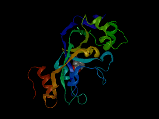
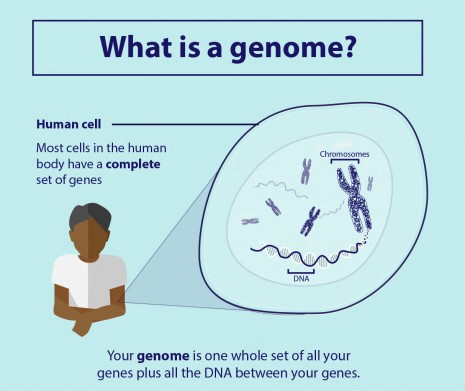
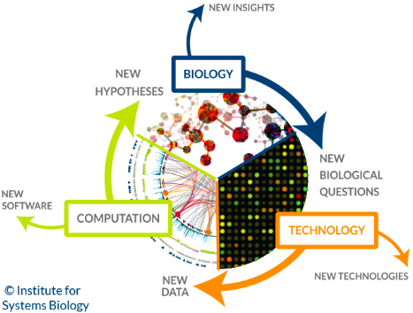

# [Explore the world of Bioinformatics with MachineLearning](https://towardsdatascience.com/explore-the-world-of-bioinformatics-with-machine-learning-47c62c482aaf)

> The article contains a brief introduction of Bioinformatics and how a machine learning classification algorithm can be used to classify the type of cancer in each patient by their gene expressions.

The application of Machine Learning to biological and neuroimaging data opens new frontiers for biomedical engineering: improving our understanding of complex diseases such as cancer or neurodegenerative and psychiatric disorders. Advances in this field can ultimately lead to the development of automated diagnostic tools and of precision medicine, which consists of targeting custom medical treatments considering individual variability, lifestyle, and environment.
Prior to the emergence of machine learning algorithms, bioinformatics algorithms had to be explicitly programmed by hand which, for problems such as protein structure prediction, proves extremely difficult.


Machine learning techniques such as deep learning enable the algorithm to make use of automatic feature learning which means that based on the dataset alone, the algorithm can learn how to combine multiple features of the input data into a more abstract set of features from which to conduct further learning. This multi-layered approach to learning patterns in the input data allows such systems to make quite complex predictions when trained on large datasets. 

In recent years, the size and number of available biological datasets have skyrocketed, enabling bioinformatics researchers to make use of these machine learning algorithms.

Machine learning has been applied to six biological domains: Genomics, Proteomics, Microarrays, Systems biology, Stroke diagnosis, and Text mining.

## Genomics
It is an interdisciplinary field of biology focusing on the structure, function, evolution, mapping, and editing of genomes. A Genome is an organism’s complete set of DNA, including all of its genes. There is an increasing need for the development of machine learning systems that can automatically determine the location of protein-encoding genes within a given DNA sequence and this problem in computational biology is known as gene prediction. 


## Proteomics
Proteomics is the large-scale study of proteomes. A proteome is a set of proteins produced in an organism, system, or biological context.


Proteins, strings of amino acids, gain much of their function from protein folding in which they conform into a three-dimensional structure. 
This structure is composed of a number of layers of folding, including the primary structure (i.e. the flat string of amino acids), the secondary structure (alpha helices and beta sheets), the tertiary structure, and the quarternary structure.

Protein secondary structure prediction is the main focus of this subfield as the further protein foldings (tertiary and quaternary structures) are determined based on the secondary structure. 

Solving the true structure of a protein is an incredibly expensive and time-intensive process, furthering the need for systems that can accurately predict the structure of a protein by analyzing the amino acid sequence directly. Prior to machine learning, researchers needed to conduct this prediction manually.

The current state-of-the-art in secondary structure prediction uses a system called DeepCNF (deep convolutional neural fields) which relies on the machine learning model of artificial neural networks to achieve an accuracy of approximately 84% when tasked to classify the amino acids of a protein sequence into one of three structural classes (helix, sheet, or coil).

## Microarrays
Microarrays, a type of lab-on-a-chip, are used for automatically collecting data about large amounts of biological material. Machine learning can aid in the analysis of this data, and it has been applied to expression pattern identification, classification, and genetic network induction.
This technology is especially useful for monitoring the expression of genes within a genome, aiding in diagnosing different types of cancer-based on which genes are expressed. One of the main problems in this field is identifying which genes are expressed based on the collected data.


Machine learning presents a potential solution to this problem as various classification methods can be used to perform this identification. The most commonly used methods are radial basis function networks, deep learning, Bayesian classification, decision trees, and random forest.

## Systems biology

Systems biology focuses on the study of the emergent behaviors from complex interactions of simple biological components in a system. Such components can include molecules such as DNA, RNA, proteins, and metabolites.


Machine learning has been used to aid in the modeling of these complex interactions in biological systems in domains such as genetic networks, signal transduction networks, and metabolic pathways. 
Probabilistic graphical models, a machine learning technique for determining the structure between different variables, are one of the most commonly used methods for modeling genetic networks.
In addition, machine learning has been applied to systems biology problems such as identifying transcription factor binding sites using a technique known as Markov chain optimization. 
Genetic algorithms, machine learning techniques which are based on the natural process of evolution, have been used to model genetic networks and regulatory structures.

## Stroke diagnosis
Machine learning methods for the analysis of neuroimaging data are used to help diagnose stroke. Three-dimensional Convolutional Neural Network(CNN) and Support Vector Machines(SVM) methods are often used.
## Text mining
The increase in available biological publications led to the issue of the increase in difficulty in searching through and compiling all the relevant available information on a given topic across all sources. This task is known as knowledge extraction. This is necessary for biological data collection which can then, in turn, be fed into machine learning algorithms to generate new biological knowledge. 
Machine learning can be used for this knowledge extraction task using techniques such as Natural Language Processing(NLP) to extract useful information from human-generated reports in a database.
This technique has been applied to the search for novel drug targets, as this task requires the examination of information stored in biological databases and journals.
Annotations of proteins in protein databases often do not reflect the complete known set of knowledge of each protein, so additional information must be extracted from biomedical literature.
Machine learning has been applied to the automatic annotation of the function of genes and proteins, determination of the subcellular localization of a protein, analysis of DNA-expression arrays, large-scale protein interaction analysis, and molecule interaction analysis.


```python

```
