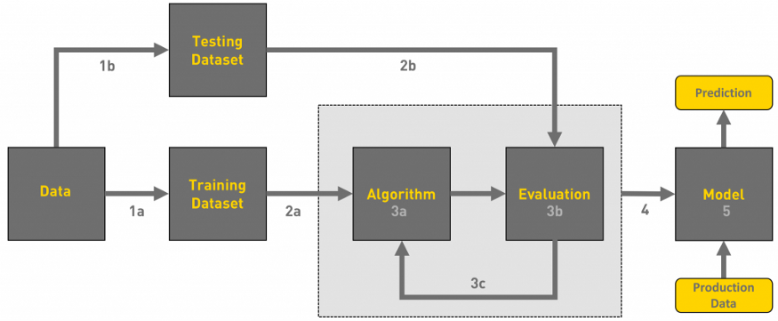
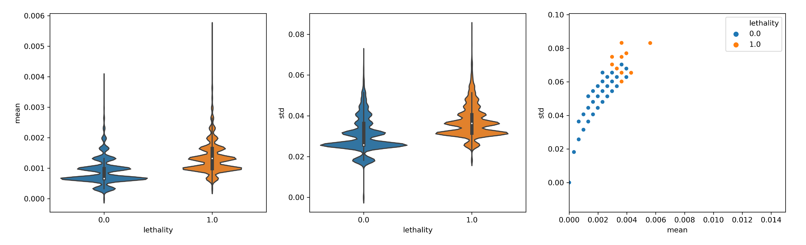
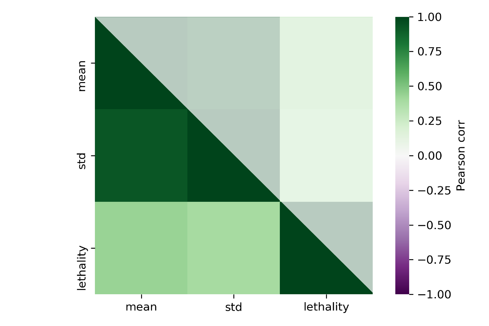
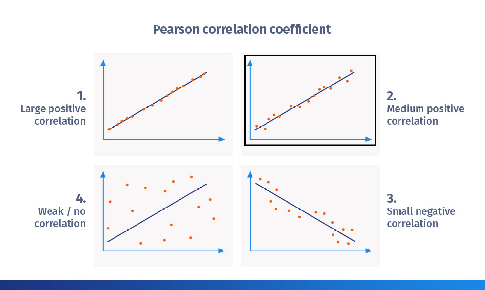
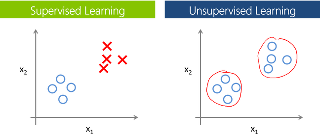
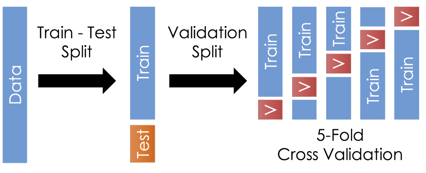

## The problem :

``` Predicting synthetic lethality pairwise interaction upon knowledge of protein domains of the pair ```

{width=70%}

# Usual workflow for any Machine learning implementation

----------------------------------------------

{width=90%}[^2]

[^2]: From https://towardsdatascience.com/workflow-of-a-machine-learning-project-ec1dba419b94

-------------------------------------------


::: incremental

1. Gathering data
2. Data pre-processing
3. Researching the model that will be best for the type of data
4. Training and testing the model
5. Evaluation[^1]

[^1]: From https://towardsdatascience.com/workflow-of-a-machine-learning-project-ec1dba419b94

::: 

# Gathering data 

---------------------------------------


{width=50%}

::: incremental

- All the current knowledge on yeast genetic interaction is in [**BioGrid**](https://downloads.thebiogrid.org/BioGRID/Release-Archive/BIOGRID-3.5.184/)

- I used all the protein domain data from Pfam, and all genetic interactions filtered by Synthetic Lethality and Positive Genetic. 

:::


# Data pre-processing

---------------------------------------

::: incremental

- I took a random subset of the whole dataset 
    - 10000/17871 SL pairs
    - 10000/43340 nSL pairs 

- Cleaning missing data by removing empty domains from the list of pairs. There are some proteins that do not have domains annotated, these ones are out for the analysis. 
  - The empty domain in the SL were: 680 out of 10000 domains
  - The empty domain in the nSL were: 670 out of 10000 domains
- Step 3: Select from the ordered indexes array of domain id list which of them appear once, in both or in any of the domains of each protein pair. 

::: 


-----------------------------------

##  Feature selection! 


What are we going  to use to distinguish between the two categories (SL and non SL)?  


-----------------------------------

## Features of the paper 

{width=80%}

--------------------------------------------

## Feature matrix


----------------------------------------


----------------------------------------


---------------------------------------------

## How nice these features differenciate between the two classes


 

-------------------------------------------------------

{width=50%}

. . .

 {width=50%}[^3]

 [^3]: From https://www.questionpro.com/blog/pearson-correlation-coefficient/


# Researching the model that will be best for the type of data 

---------------------------------------------




----------------------------


- This problem belong to the category of supervised learning. 
- I choose Support vector machine because it was the one used in the paper, this is a classification method used mainly when blinary classification is required. 


# Training and testing the model

----------------------------------------



--------------------------------

- 30% of the data is used for final test.
- The rest 70% was used for 5-fold crossvalidation to tune the parameters for such big dataset. 

# Model Evaluation

------------------------------------------


- Accuracy : The percentage of in how many cases the correct class was predicted. 

- Sensitivity : Percentage of  correctly predicted SL interactions over the total number of SL interactions in the test dataset.

- Specificity : Percentage of correctly identified negative data over the total number of negative data.

- Precision : Percentage of correctly predicted positive data over the total number of predicted positive data.

--------------------------------


***From Wikipedia***


----------------------------

## Results of the evaluation


|  	| Paper 	| My replication 	|
|------------------------------------------------	|-------	|----------------	|
| Accuracy 	| 0.84 	| 0.89 	|
| Specificity <br>(Recall of the negative class) 	| 0.83 	| 0.89 	|
| Sensitivity <br>(Recall of the positive class) 	| 0.85 	| 0.89 	|
| Precision 	| 0.83 	| 0.89 	|
| F-score  	| 0.84 	| 0.89 	|
| AUC 	| 0.927 	| 0.9 	|


------------------------------------------------

## 5- fold Cross validation study

{width=70%}


