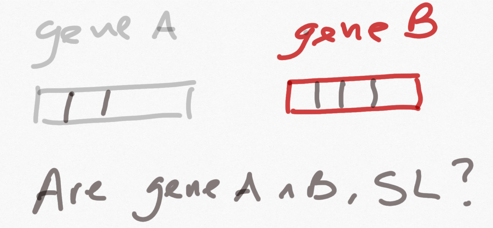
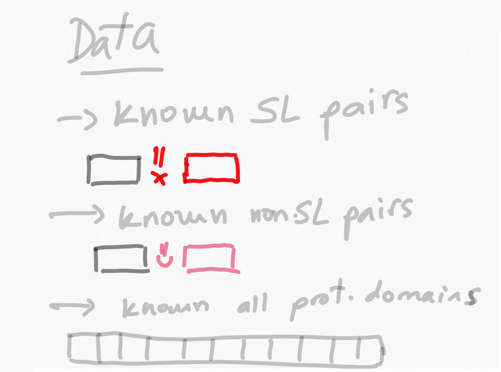
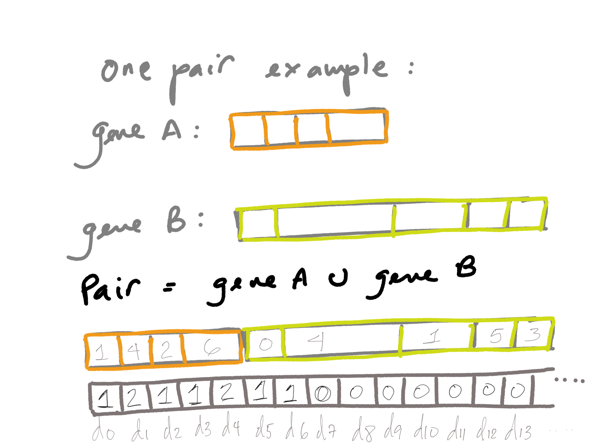
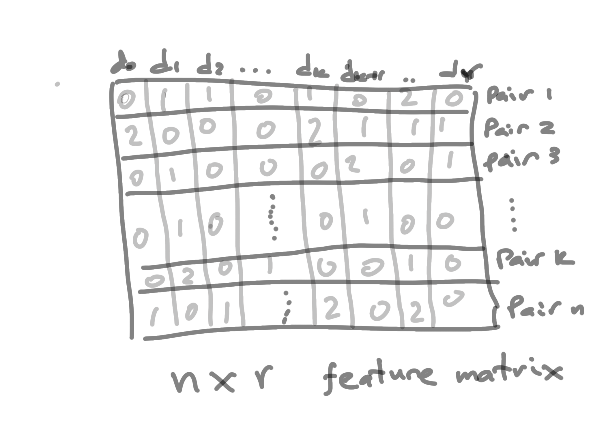
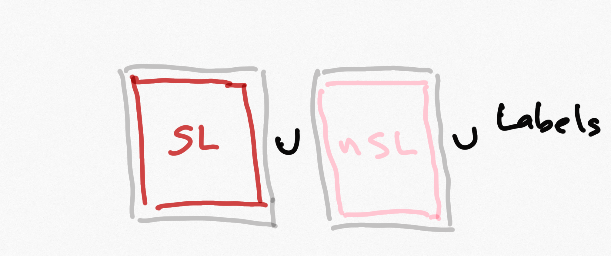
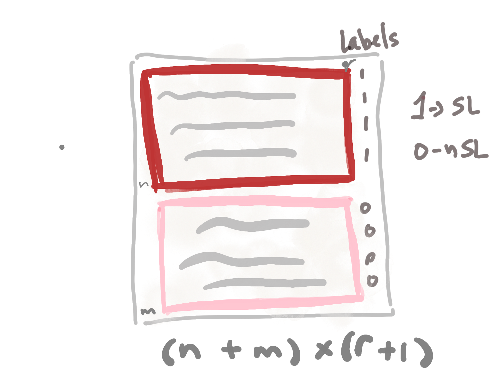
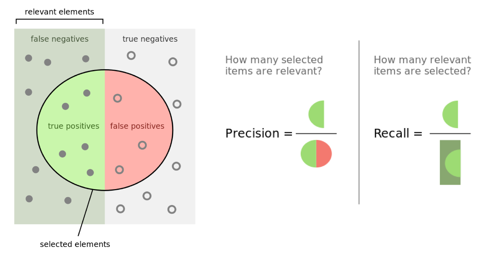
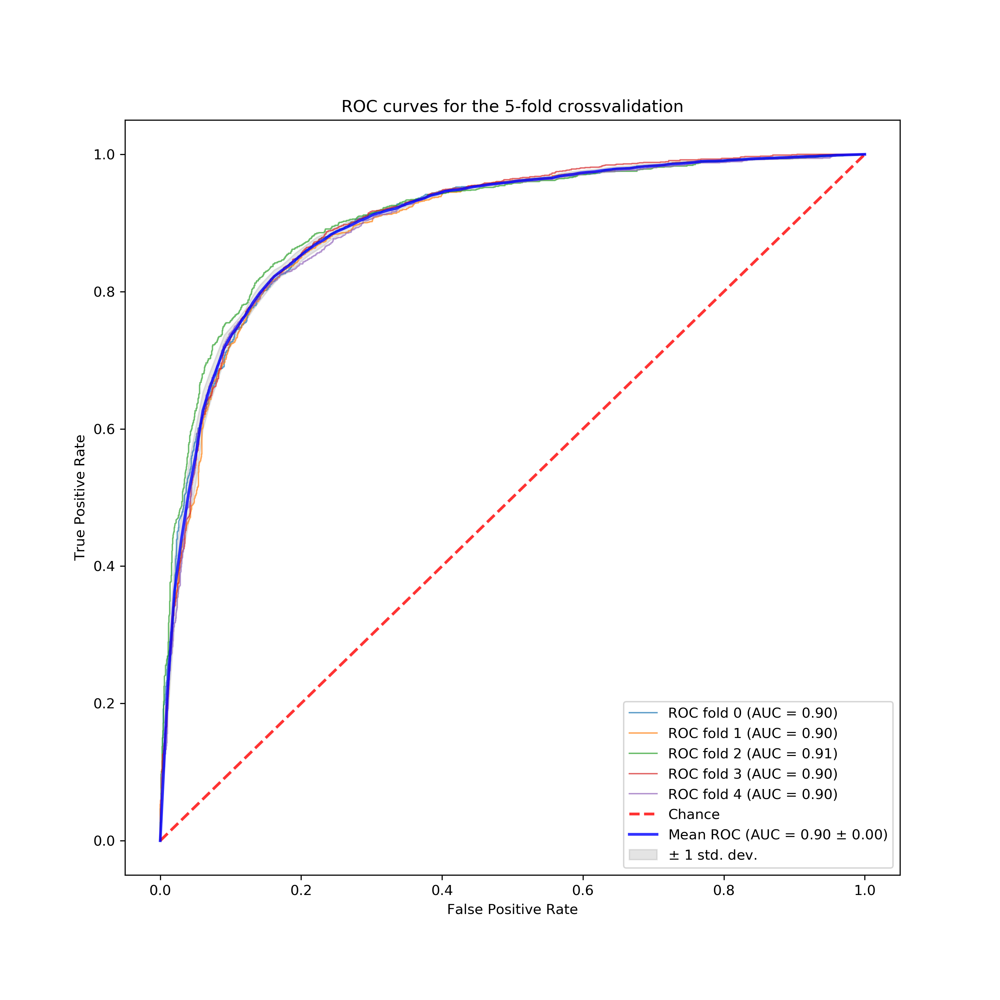

## The problem :

``` Predicting synthetic lethality pairwise interaction upon knowledge of protein domains of the pair ```

{width=70%}

--------------------------------------

## What do we need first? 

---------------------------------------

## DATA!!!

{width=70%}

-------------------------------------------

::: incremental

- All the current knowledge on yeast genetic interaction is in [**BioGrid**](https://downloads.thebiogrid.org/BioGRID/Release-Archive/BIOGRID-3.5.184/)

<!-- - For protein domains you can go to [**Yeastmine**](https://yeastmine.yeastgenome.org/yeastmine/begin.do)

    - To retrieve data using Python you should create an account in yeastmine and copy the ```python code``` generate by your search.  -->

:::

-----------------------------------

##  What do we need 2nd? 


- to implement the features of the problem in order for the method to "learn" from  


-----------------------------------

## Features of the paper 

{width=80%}

--------------------------------------------

## Feature matrix



----------------------------------------



----------------------------------------



----------------------------------

## Everything starts! :) 

::: incremental

- Splitting the data[^1] for training and testing 
- Train a classfier with the training data
- Make some predictions
- Evaluate the predictions based on the testing data. 

[^1]: The data was a random sample of 10000 pairs taken from the given datasets.

::: 


----------------------------

## Evaluating the method based on its prediction

<!-- - The mean square error = $\frac{1}{n}\Sigma(y-\hat y)^2$ , where $\hat y$ is the predicted class value and $y$ is the true class value.  -->

- Accuracy : The percentage of in how many cases the correct class was predicted. 

- Sensitivity : Percentage of  correctly predicted SL interactions over the total number of SL interactions in the test dataset.

- Specificity : Percentage of correctly identified negative data over the total number of negative data.

- Precision : Percentage of correctly predicted positive data over the total number of predicted positive data.

--------------------------------




***From Wikipedia***


----------------------------

## Results of the evaluation


|  	| Paper 	| My replication 	|
|------------------------------------------------	|-------	|----------------	|
| Accuracy 	| 0.84 	| 0.89 	|
| Specificity <br>(Recall of the negative class) 	| 0.83 	| 0.89 	|
| Sensitivity <br>(Recall of the positive class) 	| 0.85 	| 0.89 	|
| Precision 	| 0.83 	| 0.89 	|
| F-score  	| 0.84 	| 0.89 	|
| AUC 	| 0.927 	| 0.9 	|


------------------------------------------------

## 5- fold Cross validation study

{width=70%}


