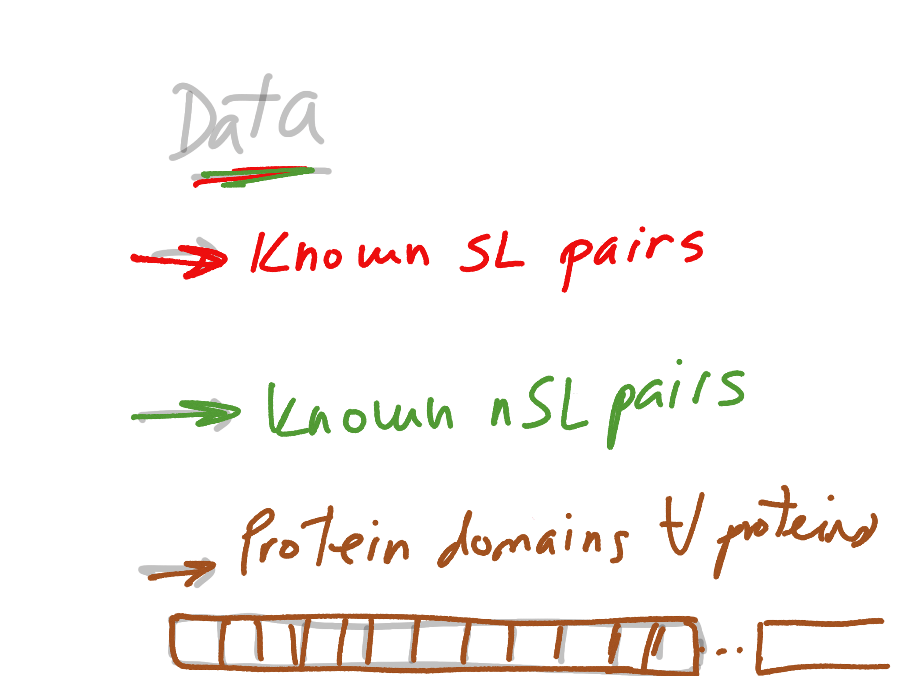

### The problem :

``` Predicting synthetic lethality pairwise interaction upon knowledge of protein domains of the pair ```

{width=70%}

--------------------------------------

### What do we need first? 

---------------------------------------

### DATA!!!

{width=90%}

-------------------------------------------

::: incremental

- All the current knowledge on yeast genetic interaction is in [**BioGrid**](https://downloads.thebiogrid.org/BioGRID/Release-Archive/BIOGRID-3.5.184/)

- For protein domains you can go to [**Yeastmine**](https://yeastmine.yeastgenome.org/yeastmine/begin.do)

    - To retrieve data using Python you should create an account in yeastmine and copy the ```python code``` generate by your search. 

:::

-----------------------------------

###  What do we need 2nd? 


::: incremental

- if we have data 
- we have information  available about our problem, 
- that we can use to learn !!! (not us but an algorithm :D)

- The question , what do we have to supply to to the algorithm in order to learn and do the job for us? 

:::


-----------------------------------

### Features of the paper 


--------------------------------------------

#### Feature matrix


----------------------------------------


----------------------------------------


----------------------------------

### Everything starts! :) 

::: incremental

- Splitting the data for training and testing
- Train a classfier with the training data
- Make some predictions
- Evaluate the predictions based on the testing data. 

::: 

----------------------------

### One form of evaluating the methods

